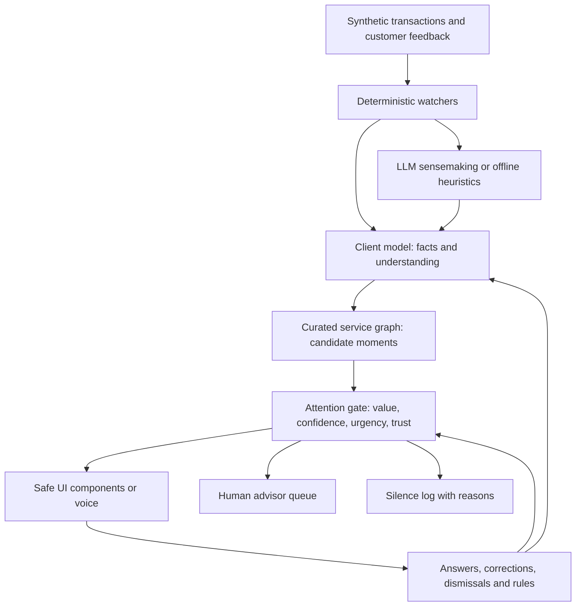

# Kairos: a bank that earns the right to speak

Proof of concept for the **KBC challenge at the Tectonic Hackathon, 30 September 2026**. Earlier project files use the name *Moments*.

Banks have plenty of customer data. The challenge is knowing which need matters today and when to stay quiet. Kairos builds an explainable, correctable customer model, connects it to a curated service graph, and uses an attention gate to deliver useful moments, route them to an advisor, or record why silence was the better choice. Three synthetic customers demonstrate the approach across budgeting, life changes, insurance and voice.

**Read the [full vision in vision.txt](vision.txt)** for the customer model, service graph, agent loop, attention and trust budgets, adaptive UI, and the approach to serving millions of customers. The vision extends beyond this prototype; the implementation and limits below describe what runs today.

## How it addresses the KBC challenge

| Challenge question | Kairos approach |
|---|---|
| Which signals reveal customer needs? | Transaction patterns, recurring payments, income and savings changes, and customer declarations. |
| How do situation, behaviour and intent shape recognition? | A facts tier plus an understanding tier, with source, confidence, evidence and dates for each belief. Customers can confirm or reject beliefs. |
| How does the experience adapt automatically? | Replies update the model; engagement, dismissal and muting update attention and trust ledgers used by the gate. |
| How does it span products and channels? | A curated service graph connects needs to help; moments can appear in the app, as voice messages, or in an advisor queue. |
| How could it reach 2.3 million customers? | Deterministic watchers filter events before LLM sensemaking. A synthetic benchmark measures watcher throughput and projects scale; it is not a production deployment. |

## Architecture and working demo



The engine replays transactions and interactions to a chosen day, making the timeline and decision evidence inspectable.

| Component | Implementation |
|---|---|
| Client model and event replay | [lib/engine.ts](lib/engine.ts), [lib/store.ts](lib/store.ts) |
| Deterministic pattern and rule watchers | [lib/watchers.ts](lib/watchers.ts) |
| Cached, schema-validated Claude sensemaking and copy, with heuristic fallback | [lib/llm.ts](lib/llm.ts) |
| 17 curated service nodes, eligibility, procedures and advisor guardrails | [lib/serviceGraph.ts](lib/serviceGraph.ts) |
| Attention gate, trust thresholds and suppression reasons | [lib/gate.ts](lib/gate.ts) |
| Safe `info / confirm / choice / slider` UI components; replies become declared information | [components/MomentCard.tsx](components/MomentCard.tsx) |
| Plain-language intent compiled into a JSON rule evaluated by code | [lib/rules.ts](lib/rules.ts) |
| ElevenLabs voice with browser speech fallback | [lib/voice.ts](lib/voice.ts) |
| Watcher throughput benchmark and scale projection | [lib/scale.ts](lib/scale.ts) |

The gate scores customer value, confidence and urgency against interruption cost. Bank revenue is excluded from the score. Commercial suggestions also face a customer-value check and trust threshold; uncertain, repeated, muted or low-value moments can be suppressed with an explicit reason.

### Synthetic customers

- **Emma, 24:** first job, grocery spending growth, an uncertain child inference, a puppy, a raise and a second-hand car.
- **Sam & Noor, 31/30:** saving for a home. Earlier dismissed offers mean lower starting trust, changing which commercial moments get through.
- **Jef, 71:** retired and prefers voice. A duplicate energy payment, rising bills and a gift to a grandchild demonstrate practical help and advisor routing.

All customer profiles and transactions are generated demo data. There is no live KBC integration.

## Run locally

Use a recent Node.js LTS release with npm. No database setup or API keys are required for the offline demo.

```bash
npm install
cp .env.example .env.local
npm run dev
```

On Windows PowerShell, use `Copy-Item .env.example .env.local` for the copy step. Open [localhost:3000](http://localhost:3000).

### Demo logins

The copied `.env.example` already contains the demo passwords below, so the logins work as soon as the server starts. All four accounts are synthetic; the passwords are throwaway demo values that protect nothing outside this prototype. Change `DEMO_PASSWORD` and `STAFF_PASSWORD` in `.env.local` (at least 10 characters each) if you host the demo anywhere public.

| Username | Password | Role | Where it lands |
|---|---|---|---|
| `analyst` | `staff-NBd_Gx_u9f3h` | Staff | Control room at `/control`: timeline, client model, silence log, advisor queue, scale benchmark and a customer preview |
| `emma` | `demo-eecTWVMK_Q0C` | Customer | Emma's app at `/app` |
| `sam` | `demo-eecTWVMK_Q0C` | Customer | Sam & Noor's app at `/app` |
| `jef` | `demo-eecTWVMK_Q0C` | Customer | Jef's app at `/app`, voice channel |

Start with `analyst` for the walkthrough below; the control room includes a customer preview, so a single login shows the whole loop. Log in as a customer to see the moments exactly as the app delivers them.

Optional integrations are configured in `.env.local`: `ANTHROPIC_API_KEY` enables Claude, `ANTHROPIC_MODEL` selects the model, and `ELEVENLABS_API_KEY` enables voice synthesis. Without keys, the app uses heuristic sensemaking and browser speech where supported. `LLM_DISABLED=1` forces the offline path. See [.env.example](.env.example) for configuration names without secret values.

```bash
npm run warm                            # Optional: precompute Claude responses; needs an API key.
npm run selftest                        # Offline replay, storyline and engine invariant checks.
npm run typecheck
npm run test:security                   # Design-preview injection and voice-cache regression tests.
npm run scale -- --customers 100000     # Synthetic watcher benchmark and projection to 2.3M customers.
npm run build
npm start                               # Serve the production build.
```

The browser regression tests use installed Microsoft Edge on Windows and Playwright Chromium elsewhere (`npx playwright install chromium`). `PLAYWRIGHT_CHANNEL` selects another installed browser channel. These tests cover specific regressions and do not replace the Aikido audit.

## Demo walkthrough (under three minutes)

1. Sign in as `analyst`, select Emma, reset her demo state if needed, move the timeline to March and press **Play**. Inspect the client model and events → watcher hits → candidates → shown counters.
2. Open **Silence log**: the card upsell fails the customer-value test, and the uncertain child inference stays quiet.
3. In the customer preview, answer a grocery-budget moment to create a rule, then advance time to see it fire. Reject a belief in **Understands**, or dismiss a moment and inspect the ledgers.
4. Open **Same event, two customers**: Emma and Sam & Noor have the same puppy storyline, but their trust histories lead to different pet-insurance outcomes.
5. Select Jef for the voice channel and open **Advisor queue** for the gift-related estate-planning moment. Open **Scale** to run the synthetic watcher benchmark.

## Security and privacy

- Customer endpoints derive ownership from the server-side session; staff endpoints require the staff role. Foreign or unknown moment IDs are rejected.
- Sessions use random 256-bit tokens, `httpOnly` cookies, `SameSite=Strict`, an eight-hour expiry and secure cookies in production. Passwords come from environment variables and are compared in constant time through a keyed digest (no slow KDF on the unauthenticated login path, so it cannot be used to burn CPU). Login is rate-limited per account and per client; forwarded IP headers are only trusted with `TRUST_PROXY=1`, and the limiter table is bounded.
- State-changing routes check supplied origins. Request bodies are capped on bytes actually received (chunked uploads included). API bodies and LLM outputs are schema-validated. Customer text is treated as data, rules are a JSON DSL, and UI content is rendered through allowed components.
- The customer API returns an allow-listed copy of each moment: gate scores, trust and attention ledgers, KBC value and template parameters never leave the server on `/api/me/*`.
- Voice synthesis accepts owned moment text. Audio cache paths use hashes; cache access rejects symbolic links and linked directories, and writes use exclusive creation.
- Local design previews use a restricted DOM renderer without string evaluation or raw HTML insertion. A Content Security Policy and the other security headers are set in [next.config.ts](next.config.ts).
- `.env.local`, runtime state and caches in `.data/` are gitignored. The prototype uses synthetic data only.

## Unfinished work and limitations

- State, sessions and rate limits assume a single application instance. Interactions and LLM responses persist as JSON in `.data/`; production needs durable storage, shared session/rate-limit infrastructure and stream processing.
- Demo users share locally configured passwords by role. There is no production identity provider, core-banking connection, payment execution or real advisor workflow.
- The service graph is a hand-written 17-node slice. Advisor routing demonstrates a guardrail; it is not a complete suitability or regulatory compliance system.
- Model correction is implemented, but production consent, retention, deletion and privacy review remain future work.
- Scale results measure the watcher layer on one core with synthetic traffic. LLM cost figures use hard-coded price, exchange-rate and token assumptions; they are estimates, not measured production costs or verified current prices.
- Live LLM and voice output depend on provider availability. Offline heuristics and browser speech demonstrate the flow but do not reproduce every live-model response.

## Hackathon deliverables

The participant guide (submission and fair-play sections) requires a short README explaining the project, setup and unfinished work, plus the following Builderbase materials:

| Deliverable | Available material / status |
|---|---|
| Short project description | The [Builderbase description](#builderbase-description) below. |
| Demo video **under 3 minutes** | Coming soon; final video/link pending Nelson's commit. |
| Public GitHub repository | [Hackathon-Tectonic](https://github.com/nelsongoossens/Hackathon-Tectonic); public accessibility must be checked for submission. |
| Aikido **before and after** screenshots | Before: [AI Code Audit findings](docs/aikido-audit.png). After: [scan following the fixes](docs/aikido-code-security-scan.png). |

Submit through Builderbase, check that judges can access every submitted link, and keep the repository public until judging ends. The guide prohibits code or submission edits after final submission. Security accounts for 10% of the assessment; the other judging criteria are creativity, technical ability and fit to the challenge.

### Builderbase description

Copy the text below into the Builderbase description field.

> **Kairos: a bank that earns the right to speak.**
>
> KBC already knows a great deal about its customers. The hard part is deciding which need matters today, whether the bank is sure enough to act, and when the most valuable response is silence. Kairos is a proof of concept for that judgement layer: the understanding and restraint engine that could sit behind an assistant like Kate and decide when it speaks.
>
> **How it understands.** Every customer gets an explainable client model with two tiers: facts drawn from transactions, recurring payments, income and savings, and an understanding tier of inferred needs, each stored with its source, confidence, evidence and date. Customers see their model and can confirm or reject any belief, so the bank's picture of them stays correctable.
>
> **How it responds.** Deterministic watchers scan events and only wake Claude for sensemaking when a pattern fires. Candidate moments come from a curated service graph that maps needs to real KBC help across budgeting, life changes, insurance and advice. An attention gate then scores customer value, confidence and urgency against interruption cost, with bank revenue excluded from the score. Each moment is delivered as a safe UI component in the app, as a spoken message through ElevenLabs, or routed to a human advisor. Anything that fails the test is written to a silence log with the reason, so restraint is auditable rather than accidental.
>
> **How it adapts.** Every answer, dismissal, correction and mute updates the client model and per-customer attention and trust ledgers. Customers can state intents in plain language ("warn me when groceries pass 400 euro"); Kairos compiles them into rules that code evaluates. Three synthetic customers show the same event producing different outcomes: Emma and Sam & Noor both get a puppy, but their trust histories decide whether a pet-insurance moment is shown or stays quiet. Jef, 71, receives help with a duplicate energy payment by voice and is routed to an advisor for an estate question.
>
> **How it scales.** Cheap watchers filter millions of events before any model call, so LLM cost is spent only where something changed. A synthetic benchmark measures watcher throughput and projects the approach to KBC's 2.3 million customers.
>
> **Security.** Customer data is scoped server-side from the session, never from client-supplied IDs. Sessions are httpOnly and SameSite=Strict, logins are rate-limited, request bodies and LLM outputs are schema-validated, and a Content Security Policy is set. The Aikido AI Code Audit findings were fixed and rescanned; screenshots are in the repository.
>
> Built with Next.js, TypeScript, Claude and ElevenLabs. Synthetic data only, no KBC integration.
